# Práctica 1: Periféricos mapeados en memoria (MMIO): Entrada/Salida de propósito general (GPIO)

## Objetivos

* Comprender el concepto de **Memory-Mapped I/O (MMIO)**.
* Analizar la organización del mapa de memoria del microcontrolador `MCU`.
* Aprender a manipular directamente los registros de entrada/salida mediante máscaras de bits en C.

## Fundamentos teóricos

En un procesador de propósito general, numerosas funciones se realizan a través de *periféricos*, componentes anexos al procesador con funciones específicas.

En la arquitectura ARM, los periféricos no se controlan con instrucciones dedicadas, sino que se comunican con la CPU a través del bus del sistema (*AXI-AHB Bus Matrix*) asignándoles direcciones físicas dentro del mapa de memoria de 32 bits (4GB).

Cada periférico posee un conjunto de **registros de control, estado y datos** ubicados en direcciones consecutivas a partir de una dirección base (*Base Address*). Escribiendo y leyendo en esas direcciones, conseguimos comunicarnos con los periféricos, que a su vez se conectarán con los diferentes pines del procesador. Los pines servirán para su conexión con el exterior con otros elementos, como LEDs, botones, pantallas, puertos, etc.

```
[ CPU ARM ]  --->  (Bus de Sistema)  --->  [ Periférico ]  --->  (Señal Interna)  --->  [ Pin Físico ]  --->  (Conexión Placa)  --->  [ Componente Externo ]
(Ejecuta C)                                (GPIO/MMIO)                                  (e.g. PA7)                                   (e.g. LED5 / Botón)
```

En nuestro caso, disponemos de un procesador `MCU`. Podemos consultar el manual de referencia `RM0431` para ver una lista completa de sus periféricos y las direcciones de memoria donde se ubican sus registros. La sección `RM0431 §1.6` detalla todo este mapa de memoria, que también mostramos brevemente a continuación.

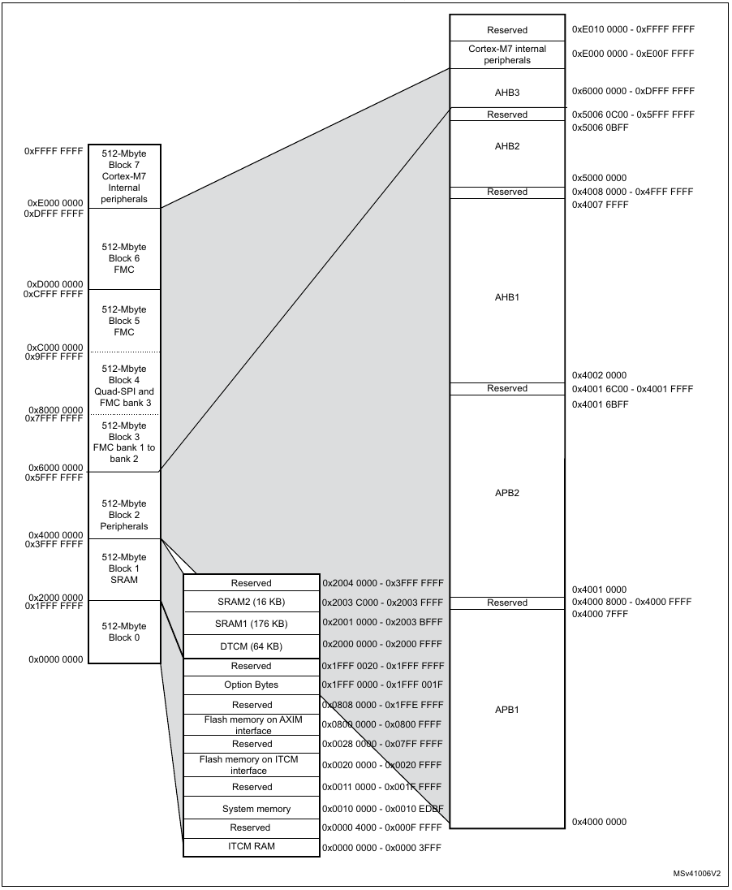

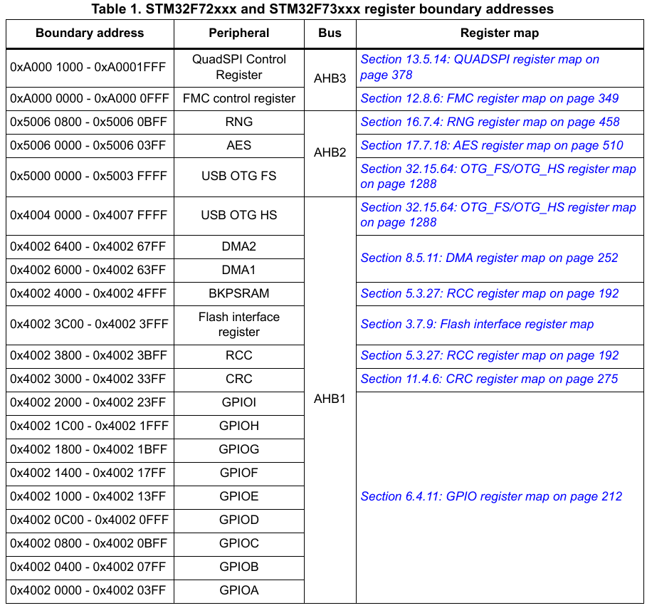

De aquí ya podemos deducir las direcciones de los diferentes controladores de GPIO. Vemos que están nombrados con letras (desde GPIOA hasta GPIOI). Por ejemplo, el controlador de GPIOA está en la dirección `0x40020000`. ¿Pero claro, cómo lo manejamos? Para ello debemos conocer todos los registros que se encuentran en esa zona de memoria. Esa información la tenemos en `RM0431 §6.4`.

A modo de ejemplo, se muestra a continuación la información referente al registro `MODER` del controlador de GPIO. Observamos que, en una palabra de 32 bits, contiene la configuración de modo de pin (Input/Output/Función alternativa/Analógico) para hasta 16 pines diferentes. Es decir, utiliza 2 bits para la configuración de cada pin. Los dos bits menos significativos corresponden al pin 0, y los 2 más significativos al pin 15, con el resto entre medias. Escribiendo en este registro configuraremos el modo de cada uno de estos pines.

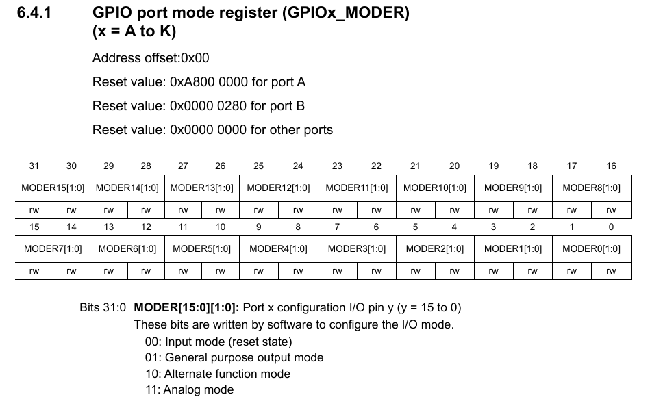

Hemos visto pues que podemos configurar ciertos puertos de entrada/salida, que a su vez cuentan con numerosos pines. Pero, ¿en qué puerto/pin se sitúa, por ejemplo, un LED?. Para ello, debemos acudir a la documentación de la placa, donde se han diseñado físicamente las conexiones desde el procesador, hasta los diferentes elementos de soporte. En concreto, en la sección `UM2140 §5.16` tenemos la lista de todas las conexiones de botones y LEDs.

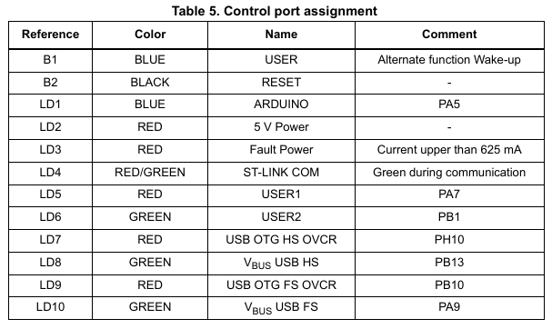

Finalmente, sabemos que, por ejemplo, el LED5 se controla desde el puerto GPIOA, en el PIN 7. El puerto A está en la dirección `0x40020000`, y dispone de varios registros que deberemos configurar adecuadamente para controlar, finalmente, el LED.

---

## Desarrollo de la práctica

### Creación del proyecto

Vamos a controlar, directamente y escribiendo en registros del procesador, un LED (en concreto, el LED5 que acabamos de ver). Pero antes, debemos crear un proyecto en STM32CubeIDE, la herramienta de desarrollo de ST. Para ello:

1. Abrimos STM32CubeIDE, buscándolo en el menú del sistema. Elegimos un workspace (o carpeta de trabajo) donde trabajar. Tras abrirlo, veremos el programa,

   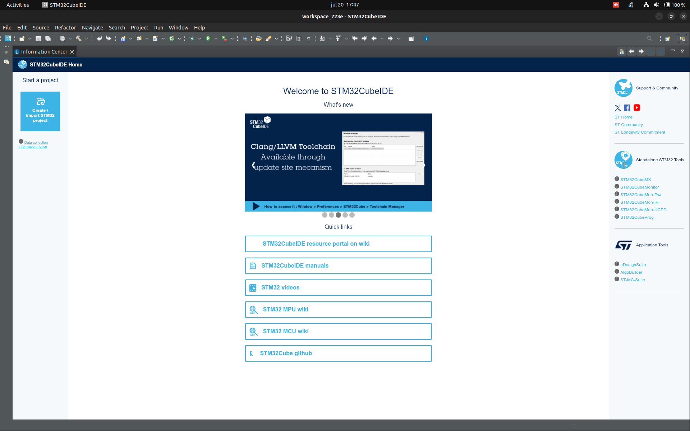  

2. Creamos un nuevo proyecto con `File > STM32 Project Create / Import`.
3. Seleccionamos `STM32CubeIDE Empty Project`.

   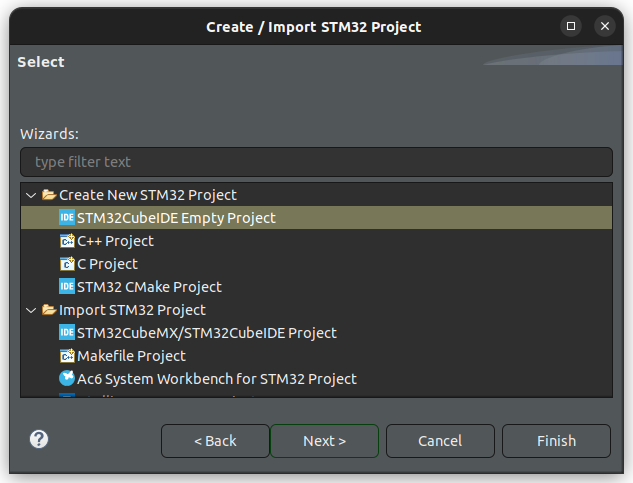

4. En `Board Selector`, buscar `723e` y seleccionar la única placa disponible.

   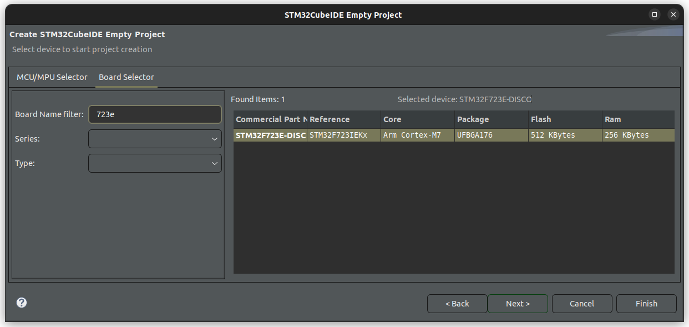  

5. Finalmente, dar un nombre al proyecto y terminar.

   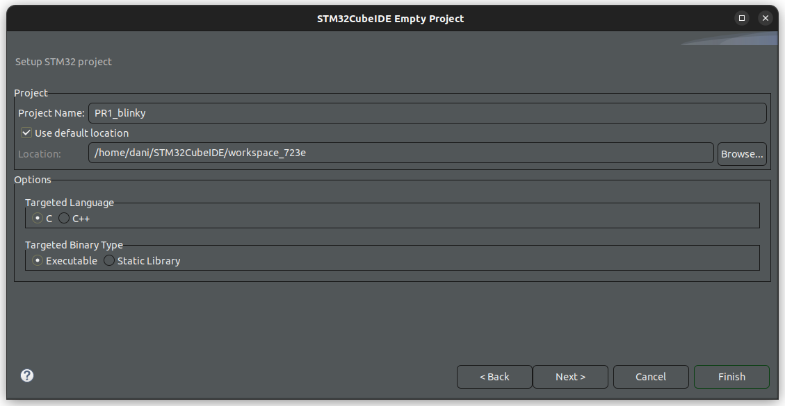  

---

### Depuración del proyecto

Ahora deberíamos tener un proyecto en blanco para trabajar. Antes de nada, vamos a probar que la conexión con la placa funciona, y podemos compilar y depurar el proyecto. Para ello:

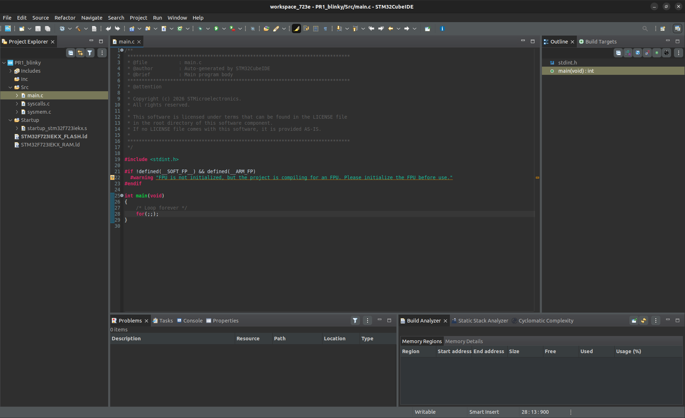  

1. Haz doble click en la carpeta `Src` dentro de tu proyecto, y luego, en `main.c`.
2. Con el archivo abierto, haz click en el martillo (build) que se encuentra en la barra superior de tareas. Verás el log de compilación en la terminal.

   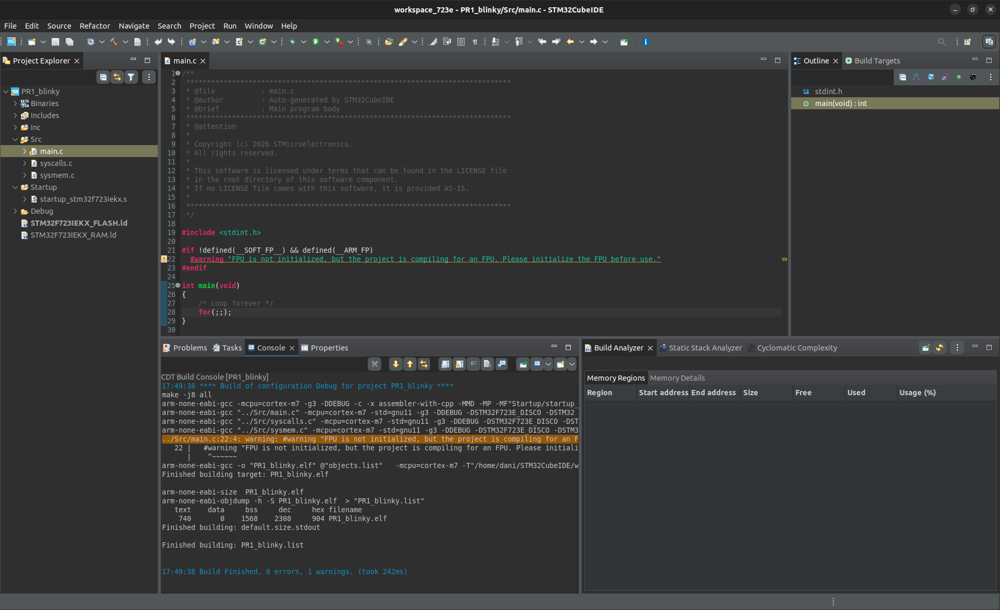  

3. Finalmente, y si no ha habido problemas, haz click en el icono de depuración (debug) en la misma barra superior (el bichito verde).
4. Acepta la configuración de depuración por defecto y vuelve a aceptar cuando pida cambiar a la vista de depuración.

   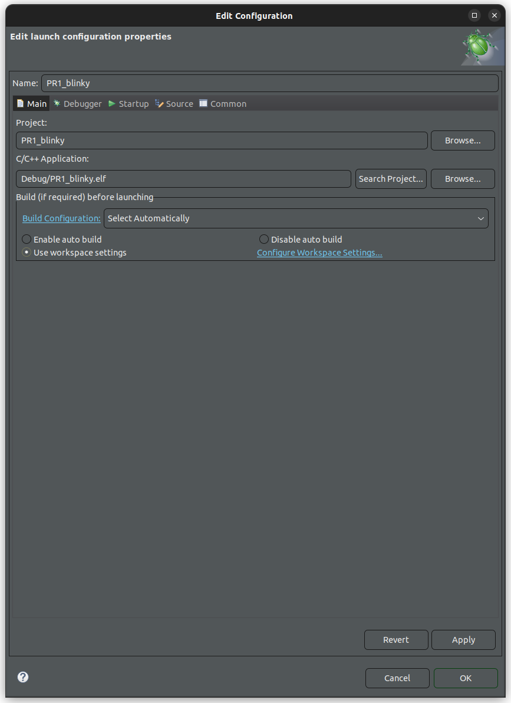  

Ahora puedes depurar el proyecto poco a poco. Entre otras, el depurador permite:
* Ir paso a paso por las líneas de código.
* Colocar *breakpoints* para parar la ejecución al llegar a ciertas líneas.
* Inspeccionar el contenido de los registros del procesador.
* Inspeccionar el contenido de los registros de los diferentes periféricos.
* Inspeccionar el contenido de la memoria.

Se recomienda explorar todas estas funcionalidades.

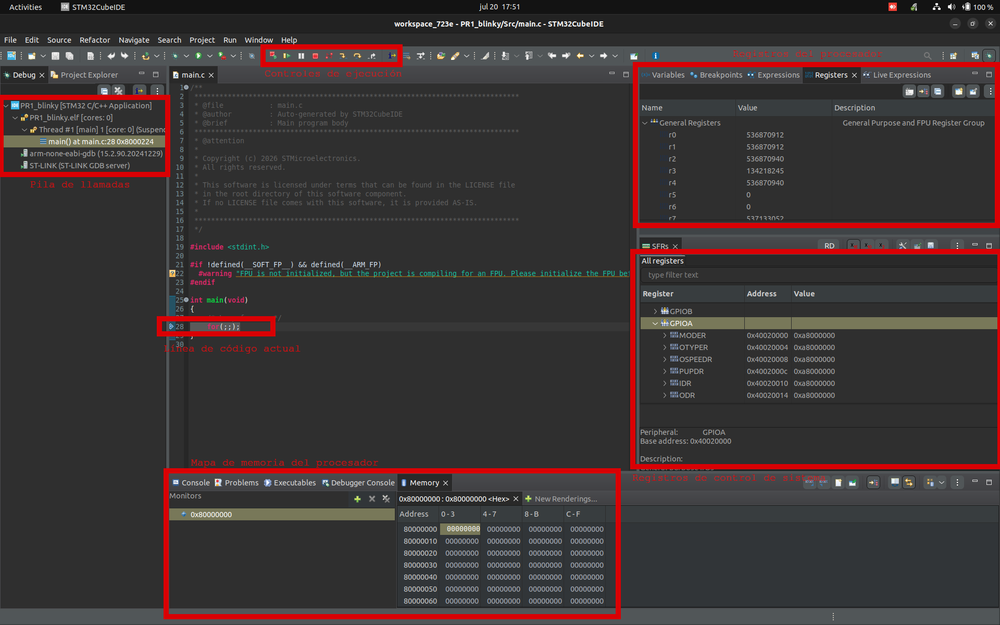  

---

### Desarrollo del proyecto

Finalmente, debemos programar nuestro código para encender el LED. Para ello, habrá que escribir en las direcciones concretas de los registros de GPIO, en este caso de GPIOA-PIN7. Recuerda que la documentación de los registros disponibles está en `RM0431 §6.4`.

* Configurar GPIOA-PIN7 como salida en `MODER`.
* Poner el pin en tipo *push-pull* en `OTYPER`.
* Configurar la velocidad a alta en `OSPEEDR`.
* Deshabilitar las resistencias en `PUPDR`.
* Finalmente, se podrá escribir el valor del led (0/1) a través de `ODR`. Otra opción es escribir directamente al registro `BSRR`, que tiene la ventaja de evitar lecturas o escrituras múltiples (aunque para nuestro caso no afecta en nada).

Adicionalmente, tenemos que activar el reloj del periférico GPIOA a través del registro `RCC_AHB1ENR` (`RM0431 §5.3.10`). La dirección base la podemos consultar en `RM0431 §1.6.2`.

Quizá te quede la pregunta de cómo narices escribo yo en una dirección de memoria concreta... la respuesta son... ¡punteros!

```c
// Imaginemos que quiero escribir en la dirección 0x40020000
// justo en los bits 14-15
// (por lo que sea)

// borro configuración actual (máscara con ceros en las posiciones de interés)
* ((uint32_t *) (0x40020000)) &= ~(0b11 << (7*2));
// pongo la configuración que me interesa
* ((uint32_t *) (0x40020000)) |=   0b01 << (7*2);
```

Aprovecha también esta función para hacer que parpadee cada cierto tiempo:

```c
void delay(int loops) {
    for (int i = 0; i < loops; i++) {
        __asm("nop");
    }
}
```

---

### Solución

[Disponible aquí](src/main.c)
